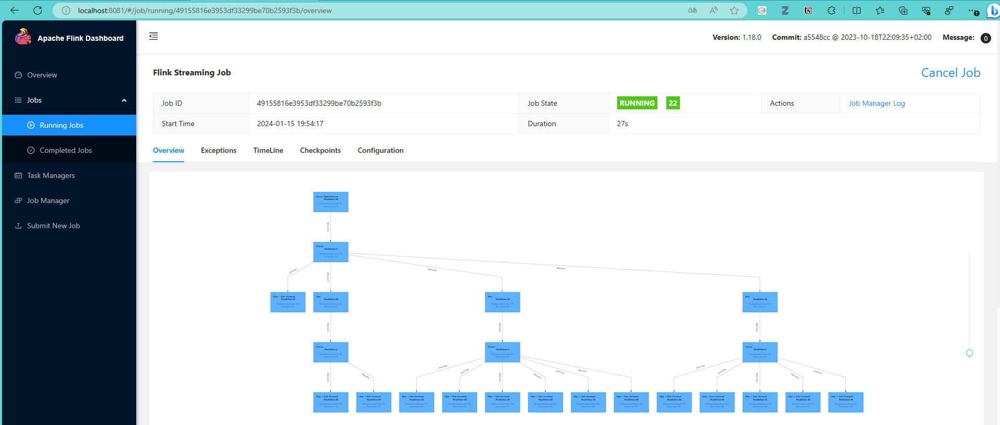
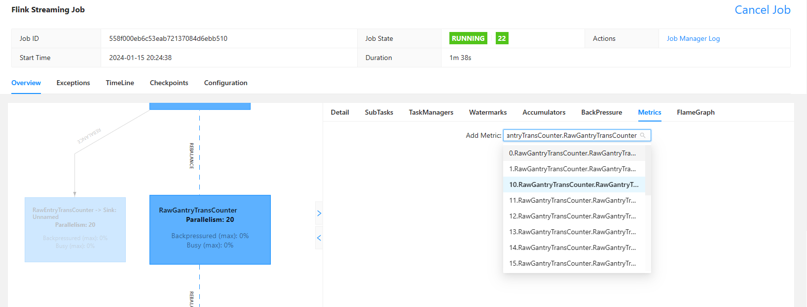
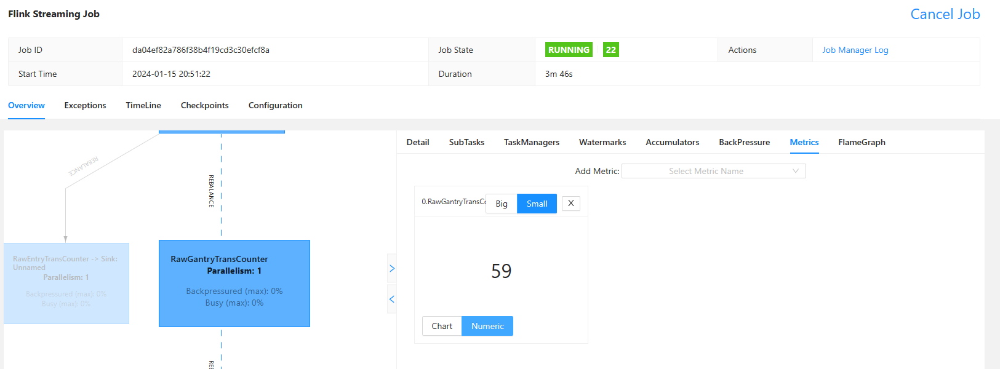

# Highlink

## 一、环境配置说明

### 1. H2数据库

- 下载H2数据库: https://www.h2database.com/html/download.html 
- 启动数据库: https://www.h2database.com/html/tutorial.html#tutorial_starting_h2_console
- 登陆h2数据库web管理界面后，运行 test 目录下的 `info.nemoworks.highlink.model.mapper.CreateTableSQL` 程序，输出数据库的建表语句，据此在数据库中创建相应的数据表
- 创建完成后，断开管理界面的连接

### 2. kafka 配置
- 下载 Kafka（目前用的版本是 kafka_2.12-3.6.1）: https://kafka.apache.org/downloads
- 配置 kraft 模式的参数（config/kraft/server.properties 文件中的节点地址、log位置等）：https://kafka.apache.org/documentation/#kraft_config
- 格式化数据目录（第一次启动）： (1) 用kafka-storage.sh 生成一个唯一的集群ID (2) 根据产生的 ID，进行初始化
```
./bin/kafka-storage.sh random-uuid
```
 #会生成一个uuid
```
./bin/kafka-storage.sh format -t <这里为生成的uuid> -c ./config/kraft/server.properties
```
- 启动kafka时: 
```
./bin/kafka-server-start.sh ./config/kraft/server.properties
```
- 运行以下代码创建 “HighLink” 主题（--bootstrap-server 后为配置文件中配置的 kafka 节点的地址）：
```
./bin/kafka-topics.sh --create --topic HighLink --bootstrap-server 192.168.0.113:9092 
```

### 3. flink 服务器配置（ide 本地执行可省略）
- 下载 flink 安装包并在服务器自定义目录解压 (目前用的版本是 flink-1.18.0): https://flink.apache.org/downloads/
- 修改 config/flink-conf.yaml 文件， 配置集群中节点信息：
```
# JobManager 节点地址.
jobmanager.rpc.address: localhost
jobmanager.bind-host: 0.0.0.0
rest.address: localhost
rest.bind-address: 0.0.0.0
# TaskManager 节点地址.需要配置为当前机器名
taskmanager.bind-host: 0.0.0.0
taskmanager.host: localhost
taskmanager.numberOfTaskSlots: 12
```
- 修改 workers 文件，指定工作节点
```agsl
localhost
```
- 修改 workers 文件，指定主节点
```agsl
localhost:8081
```
- 启动 flink 集群（这里只有单个节点; Standalone 运行模式）
```
./bin/start-cluster.sh 
```
- 访问 服务器ip:8081 地址查看flink 集群信息

### 4. 程序参数配置
- 根据本地 H2 账户信息修改 `info.nemoworks.highlink.connector.JdbcConnectorHelper` 中 `getJdbcConnectionOptions` 函数的连接信息
- 根据本地 kafka 配置信息修改 resource 目录下 `kafkaBasic.properties` 中 kafka 地址
- 指定本地 checkpoint 的存储位置，修改 `info.nemoworks.highlink.Main` 中的
```
checkpointConfig.setCheckpointStorage("file:///WDC/users/chensc/modules/flink-1.18.0/checkpoints");
```
## 二、程序运行
- **提示**：运行前请确保数据库和 kafka 服务已经启动 ！！！
- **版本说明**：目前实现了同时对10万辆车的路径聚合测试，数据处理速度为 200条/秒，为此涉及到以下的代码更新，需要在服务器上进行配置调优:

: (1) 采用新的数据生成代码 `info.nemoworks.highlink.kafka.GenerateBigWindowGantryPath`, 基本设置是使用 40 个线程，同时生成10万条路径数据（包括entry,gantry,exit； 路径长度为10），数据内容基本相同，此后会采用更真实的数据模拟系统
: (2) 路径聚合期间，在车辆下高速之前（收到 exit 数据，或者超时）需要保存记录此前已有的路径状态，这里采用 `RocksDBStateBackend` 状态后端以保证充足的数据存储空间；容错策略为每 10s 进行一次通用增量 checkpoint 存储，具体设置值见第二点服务器运行说明

### 1. ide 本地运行（不需要配置 flink 环境）
- 修改 `info.nemoworks.highlink.Main` 中的 flink 执行环境如下所示（注释第一行，使用第二行），以在本地显示 flink web-ui
```
        // 1. 创建执行环境
        //StreamExecutionEnvironment env = StreamExecutionEnvironment.getExecutionEnvironment(new Configuration());
        // 本地 web-ui 显示方式
        StreamExecutionEnvironment env = StreamExecutionEnvironment.createLocalEnvironmentWithWebUI(new Configuration());
```
- 运行`info.nemoworks.highlink.Main`
- 访问 `localhost:8081` 在 web-ui 上查看任务的详细信息 

- 运行 test 目录下 `info.nemoworks.highlink.kafka.RunKafkaProducer` 程序，向kafka 产生数据
- 查看数据流处理过程中的 metrics。对于数据流中每一个以 Counter 结尾命名的算子，都可以通过点击选中该算子后，在 web-ui 右侧 Metric 菜单中添加同名的 Metric 监控信息，如下图所示，为`RawGantryTransCounter`算子添加 RawGantryTransCounter.RawGantryTransCounter metric 信息：


- 在 web ui 上取消任务或停止程序
- 重新登陆h2数据库web管理界面，查询数据表的数据

### 2. 服务器运行 （需要配置 flink 环境）
- 将程序打包，将 jar 包（highlink-0.0.1-SNAPSHOT-jar-with-dependencies.jar）上传到 flink 安装目录下
- 配置 flink 服务器, 分配 6G 内存，启用增量 checkpoint，配置存储位置
```agsl
# 重新分配 flink 的内存大小
taskmanager.memory.process.size: 6144m
taskmanager.memory.managed.fraction: 0.4
taskmanager.memory.network.fraction: 0.05
# 启用状态后端的通用增量 checkpoint
state.backend.changelog.enabled: true
state.backend.changelog.storage: filesystem
dstl.dfs.base-path: file:///WDC/users/chensc/modules/flink-1.18.0/changeLog/
state.backend.changelog.periodic-materialize.interval: 3 min
```
- 启动集群
```
./bin/start-cluster.sh
```
- 通过命令行，向集群提交任务（-m 后的服务器地址根据自己配置的 master 调整）：
```
./bin/flink run -m localhost:8081 -c info.nemoworks.highlink.Main ./highlink-0.0.1-SNAPSHOT-jar-with-dependencies.jar
```
- 运行 `info.nemoworks.highlink.kafka.GenerateBigWindowGantryPath` 产生路径数据
- 在 flink 的 web-ui 上查看 Running Job 的详细信息, 数据流相对于此前增加了数据聚合窗口

- 查看数量流处理过程中的 metric
- 查看 checkpoint 保存情况：定时、通用增量式存储; CheckPointed Data Size 为当前检查点相对于上一轮新增的数据，Full Checkpoint Data Size 为检查点当前的数据总量


